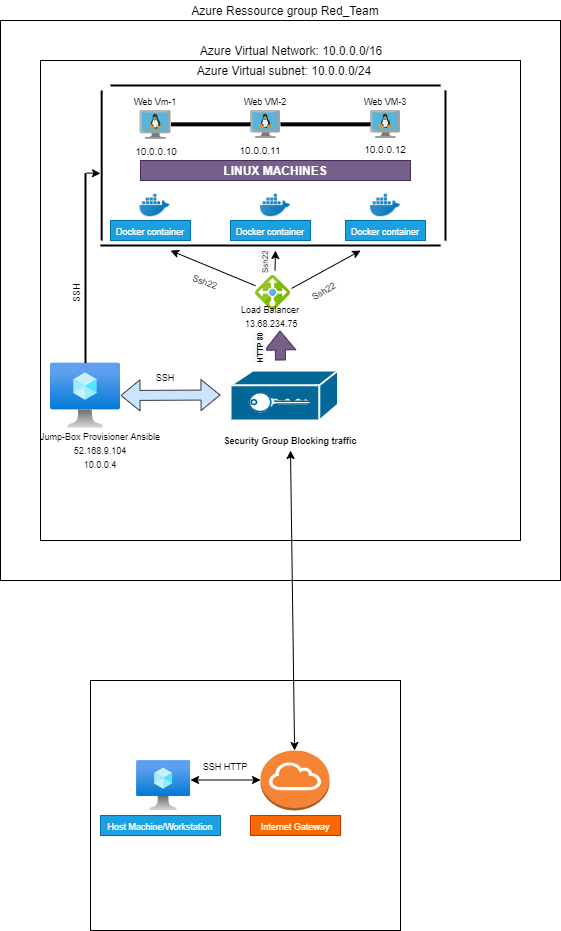

# Elk-Stack-Project
This is my Elk Stack Project for Week 13 of my Upenn BootCamp Spot
# Automated ELK Stack Deployment

The files in this repository were used to configure the network depicted below.

These files have been tested and used to generate a live ELK deployment on Azure. They can be used to either recreate the entire deployment pictured above. Alternatively, select portions of the Ansible Configuration file may be used to install only certain pieces of it, such as Filebeat.

# Playbook File
name: Config Web VM with Docker hosts: webservers 
become: true tasks
name: docker.io apt: 
      update_cache: yes 
      docker.io state: present
name: Install pip3 apt 
      python3-pip state: present
name: Install Docker python module pip
name: docker state: present
name: download and launch a docker web container docker_container 
name: dvwa image: cyberxsecurity/dvwa state: started restart_policy: always published_ports: 80:80
name: Enable docker service systemd: 
      docker enabled: yes

This document contains the following details:

- Description of the Topologu
- Access Policies
- ELK Configuration
- Beats in Use
- Machines Being Monitored
- How to Use the Ansible Build

### Description of the Topology

The main purpose of this network is to expose a load-balanced and monitored instance of DVWA, the D*mn Vulnerable Web Application.

Load balancing ensures that the application will be highly available, in addition to restricting access to the network.

- The security aspects that load balancers protect the internal network of VMs allowing availability of security in regards to the CIA Triad model.
- The advantage of a JumpBox is the orgination point for launching Administrative Tasks preventing Virtual Machines to be exposed to public. This ultimately sets the JumpBox as a Secure Admin Workstation. All Administrators when conducting any Task will be required to connect to the JumpBox which actually opens one port instead of multiple ones.

Integrating an ELK server allows users to easily monitor the vulnerable VMs for changes to the _____ and system _____.
- Filebeat watches for log files/locations and collects log events
- Metricbeat records metric and statistical data from the operating system and from services running on the server.

The configuration details of each machine may be found below. (http://www.tablesgenerator.com/markdown_tables)

|    Name    	|   Function  	| Private IP   address 	|  Operating   System  	|
|:----------:	|:-----------:	|:--------------------:	|:--------------------:	|
| ELK Server 	|     Elk     	|       10.2.0.4       	| Linux (ubuntu 18.04) 	|
|  Web-VM 1  	| Docker-DVWA 	|       10.0.0.10      	| Linux (ubuntu 18.04) 	|
|  Web-VM 2  	| Docker-DVWA 	|       10.0.0.11      	| Linux (ubuntu 18.04) 	|
|  Web-VM 3  	| Docker-DVWA 	|       10.0.0.12      	| Linux (ubuntu 18.04) 	|
|  Jump Box  	|   Ansible   	|       10.0.0.4       	| Linux (ubuntu 18.04) 	|

### Access Policies

The machines on the internal network are not exposed to the public Internet. 

Only the JumpBox machine can accept connections from the Internet. Access to this machine is only allowed from the following IP addresses:
- Pesonal IP Address

Machines within the network can only be accessed by SSH.
- The Jump Box is allowed to access the ELK Server VM and has a Private IP of 10.0.0.4.

A summary of the access policies in place can be found in the table below.

|    Name    	| Publicly   Accessible 	|      Allowed IP   Addresses     	|
|:----------:	|:---------------------:	|:-------------------------------:	|
|  Jump Box  	|           NO          	| 10.0.0.10, 10.0.0.11, 10.0.0.12 	|
| Elk Server 	|           NO          	|      10.2.0.4 & Personal IP     	|
|    Web 1   	|           NO          	|             10.0.0.7            	|
|    Web 2   	|           NO          	|             10.0.0.8            	|
|    Web 3   	|           NO          	|             10.0.0.9            	|

### Elk Configuration

Ansible was used to automate configuration of the ELK machine. No configuration was performed manually, which is advantageous because...
- The main advantages of automating configuration with Ansible is to make tasks easy to IT Admins so the can work on more important things 

The playbook implements the following tasks:
- Create New VM or "Elk-Server" which Private IP is needed to SSH into the VM and its Public IP to connect to the Kibana Portal.
- Download and Configure the "elk-docker" container "In the hosts.conf --- add a new group [elkservers] and a Private IP to the group. Then create a new ansible-playbook that will download, install, configures the "Elk-Server" to map and starts the container.
- Launch and expose the container "After installing and starting the new container, verify that the container is up and running by SSHing into the container from the JumpBox. Then run the command sudo docker ps
- Create new Inbound Security Rules to allow Ports: 5601 and 9200 which should only allow access from a Personal Network
- Open a new browser and type in the [Public IP:5601] to access the Kibana Portal

The following screenshot displays the result of running `docker ps` after successfully configuring the ELK instance.

### Target Machines & Beats
This ELK server is configured to monitor the following machines:
- _TODO: List the IP addresses of the machines you are monitoring_

We have installed the following Beats on these machines:
- _TODO: Specify which Beats you successfully installed_

These Beats allow us to collect the following information from each machine:
- _TODO: In 1-2 sentences, explain what kind of data each beat collects, and provide 1 example of what you expect to see. E.g., `Winlogbeat` collects Windows logs, which we use to track user logon events, etc._

### Using the Playbook
In order to use the playbook, you will need to have an Ansible control node already configured. Assuming you have such a control node provisioned: 

SSH into the control node and follow the steps below:
- Copy the _____ file to _____.
- Update the _____ file to include...
- Run the playbook, and navigate to ____ to check that the installation worked as expected.

_TODO: Answer the following questions to fill in the blanks:_
- _Which file is the playbook? Where do you copy it?_
- _Which file do you update to make Ansible run the playbook on a specific machine? How do I specify which machine to install the ELK server on versus which to install Filebeat on?_
- _Which URL do you navigate to in order to check that the ELK server is running?

_As a **Bonus**, provide the specific commands the user will need to run to download the playbook, update the files, etc._
